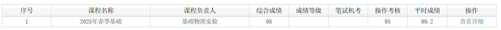

# PHY104B_SUSTech_Experiments_of_Fundamental_Physics

SUSTech 基础物理实验 2025 Spring

**基础物理实验群——QQ：738363042**

小实验成绩一览：


大实验成绩以总评：


**TIPS**

1. 连续读数的仪器要估读（各种刻度尺、显微镜上的刻度、等），其他的不用估读，部分特殊情况以老师要求为准；
2. 热敏电阻的作图是开氏度（K），不然两张图分数全扣；
3. 杨氏模量的光杠杆（三脚镜）长度最后或者最开始再测，否则会导致其他数据白测；
4. 老师讲实验内容的时候一定要认真听，之后操作的时候严格按照老师要求；
5. 各种计算一定要注意有效数字位数；
6. 这学期遇到算不确定度的实验只有每个人都会做的单摆和时间测量，所以计算不确定度这方面无法提供帮助；
7. 报告认真写，一定要注意细节，特别是单位、物理量名称、字母这种容易写写漏错的地方；
8. 数据分析一定要有代入物理量的过程，e.g. $\omega=\sqrt{\dfrac{g}{L}}=\sqrt{\dfrac{9.7887m/s^2}{0.5556m}}=4.197rad/s$
9. 图表一定要有横轴、纵轴的物理量名称（或者字母）及其单位，还要有标题；
10. 实验过程有不清楚的问题或者遇到意外情况请即时向老师反映，老师一般是不会为难你的；
11. 大实验的Pre注意不要超时，这学期是6min的展示和2min的问答，部分老师会在到时间后直接打断（我们组超时了不少，感谢老师不杀之恩（还有记得要脱稿；
12. to be Filled...

p.s.
- 大实验录制的视频有点大，没放在文件夹里；
- 计算都是用计算器和origin，懒得写程序，所以没有程序；
- 一些origin项目里面内容即繁又乱，请不要直接拿来改了数据就用；
- 大实验拟合用的matlab，gpt写的代码，应该相当易于阅读。
- 报告用的是`Fonts/`目录下的字体，使用时记得改路径，懒得折腾字体可以直接把以下代码删掉：
```
\setmainfont{Palatino_Linotype}[
  Path = ../Fonts/,
  Extension = .ttf
]
\setCJKmainfont{SimHei}[
  Path = ../Fonts/,
  Extension = .ttf
]
\punctstyle{kaiming}
```

> 最后推荐一个LaTeX环境搭建教程：
> 
> https://zhuanlan.zhihu.com/p/166523064

> 鸣谢：中国科学院大学基础物理实验报告$\LaTeX$模板
> 
> https://www.overleaf.com/latex/templates/zhong-guo-ke-xue-yuan-da-xue-ji-chu-wu-li-shi-yan-bao-gao-latexmo-ban-guan-fang-tui-jian-ban/jjcmrzbhrmmg