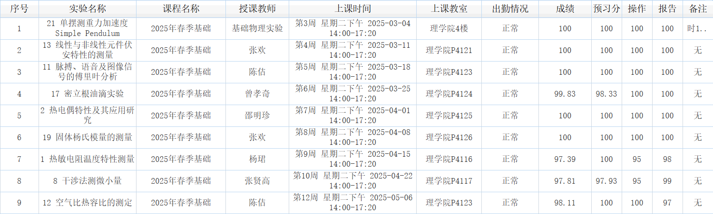

# PHY104B_SUSTech_Experiments_of_Fundamental_Physics

SUSTech 基础物理实验

**基础物理实验群——QQ：738363042**

小实验成绩一览：

**TIPS**

1. 连续读数的仪器要估读（各种刻度尺、显微镜上的刻度、等），其他的不用估读，部分特殊情况以老师要求为准；
2. 热敏电阻的作图是开氏度（K），不然两张图分数全扣；
3. 杨氏模量的光杠杆（三脚镜）长度最后或者最开始再测，否则会导致其他数据白测；
4. 老师讲实验内容的时候一定要认真听，之后操作的时候严格按照老师要求；
5. 各种计算一定要注意有效数字位数；
6. 这学期遇到算不确定度的实验只有每个人都会做的单摆和时间测量，所以计算不确定度这方面无法提供帮助；
7. 报告认真写，一定要注意细节，特别是单位、物理量名称、字母这种容易写写漏错的地方；
8. 数据分析一定要有代入物理量的过程，e.g. $\omega=\sqrt{\dfrac{g}{L}}=\sqrt{\dfrac{9.7887\;m/s^2}{0.5556\;m}}=4.197\;rad/s$
9. 图表一定要有横轴、纵轴的物理量名称（或者字母）及其单位，还要有标题；
10. 实验过程有不清楚的问题或者遇到意外情况请即时向老师反映，老师一般是不会为难你的；
11. to be Filled...

大实验成绩暂未出分，日后出分会更新整理其文件，并写Tips。